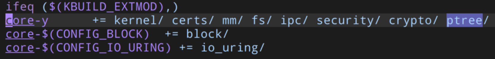
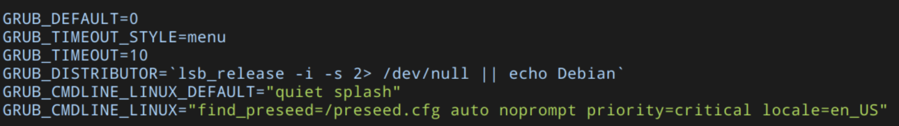

# ptree

## 1. 程序的主要设计思路、实现方式

### 1.1 设计思路

#### 1.1.1 主要步骤

程序的设计思路可以大致分为以下步骤：
- 在[https://www.kernel.org](https://www.kernel.org)下载linux内核源码，下载后进行解压；
- 将用于实现该系统调用的代码添加到内核源码目录下，并将对应位置进行修改，在内核源码上添加新的系统调用；
- 对内核代码进行编译，并进行安装，完成内核替换；
- 对新添加的系统调用进行测试。

#### 1.1.2 系统调用功能实现思路

为了将进程父子关系组织成树形结构，可以遍历进程描述符，取得每个进程的进程号和父进程号组合为父子关系对，然后根据所有的父子进程号对，重新建立起进程树形结构，然后递归打印进程树，得到进程的树形结构组织。

### 1.2 实现方式

#### 1.2.1 实验环境

- Ubuntu 22.10 (64 bit) on VMware Workstation 16 Player
- 11th Gen Intel® Core™ i5-1135G7 × 4, 3.8 GiB Memory, 42.9 GiB Disk

#### 1.2.2 添加系统调用的方式

在GNU/Linux上添加一条新的系统调用通常有两种实现方式。第一种是“编译内核法”，这种方式是比较常见的，也是本文采用的方式；另外一种方法为“内核模块法”，这种方法通过编写内核模块代码修改系统调用表所指向的地址来实现系统调用，这种方法的优点是不用编译内核代码和内核替换，可以在内核运行期间动态地添加系统调用。

本文采用的是编译内核法，下面进行详细的介绍：
1. 在[GNU/Linux官网](https://www.kernel.org)下载内核源码，本文选择的内核版本为5.15.85，并对其进行解压；

```bash
wget https://cdn.kernel.org/pub/linux/kernel/v5.x/linux-5.15.85.tar.xz
tar xvf linux-5.15.85.tar.xz
```

2. 进入解压后的内核源码目录，创建一个新的目录用来存放编写的系统调用代码；

```bash
cd linux-5.15.85
mkdir ptree
vim ptree/ptree.c # 编写添加的系统调用代码
vim ptree/Makefile # 里面编写obj-y := ptree.o
```

3. 对内核源代码根目录下的Makefile文件进行修改，添加上面新建的ptree目录，如下图所示：



4. 注册系统调用

GNU/Linux中的每个系统调用都有一个唯一的系统调用号，所有系统调用都需要在指定的表格`arch/x86/entry/syscalls/syscall_64.tbl`中定义（64位x86架构）。
本实验采用的linux-5.15.85中64位系统调用号占用到448，故新添加的系统调用`ptree`的系统调用号为449，如下图所示：


5. 声明系统调用

在GNU/Linux中，所有的系统调用都是为了给用户态开放接口，所以添加的系统调用还需要在内核源码中头文件include/linux/syscalls.h中进行声明，格式如下所示；

```c
asmlinkage long sys_ptree(void);
```

`long`为系统调用的返回值类型，`ptree`是系统调用的名称，该系统调用没有参数，所以参数列表为`void`。

6. 编译和安装内核
    1. 安装编译所需依赖：
    
    ```bash
    sudo apt install libncurses5-dev make openssl libssl-dev bison flex -y
    ```
    2. 配置

    ```bash
    make menuconfig
    ```

    执行如上命令，会弹出TUI界面来配置内核，这里采用默认配置即可。

    3. 编译内核代码

    ```bash
    make -j4
    ```

    执行make对内核代码进行编译（这里的j4表示使用4个线程并行编译）。

    4. 安装模块

    ```bash
    sudo make modules_install
    ```

    该步骤将内核源码中编译好的内核模块进行安装。

    5. 安装内核

    ```bash
    sudo make install
    ```

安装完成之后，可以在/lib/modules下看到安装好的linux内核目录，如下所示：


7. 重启虚拟机，选择对应的linux内核，进入系统，确认当前内核替换成功：


## 2 程序的模块划分及其说明

### 2.1 定义进程树形节点和链式前向星结构

进程树的每个节点存储进程号pid和对应的进程名，first_child用来存储当前节点的第一个子节点，next_sibling用来存储下一个兄弟节点。

```c
struct TreeNode {
  int pid; // 进程号
  char *comm; // 进程名
  struct TreeNode *first_child;
  struct TreeNode *next_sibling;
};

struct LinkedListNode {
  struct TreeNode* data;
  struct LinkedListNode* next;
};

// 创建进程树节点
static struct TreeNode *create_node(int pid, char *comm) {
  struct TreeNode *node = kmalloc(sizeof(struct TreeNode), GFP_KERNEL);
  node->pid = pid;
  node->first_child = NULL;
  node->next_sibling = NULL;
  node->comm = comm;
  return node;
}
// 将新节点插入到父节点的子节点列表中
static void add_child(struct TreeNode *parent, struct TreeNode *child) {
  // 采用头插法
  child->next_sibling = parent->first_child;  
  parent->first_child = child;
}
```

### 2.2 根据父子关系重建进程树结构

```c
// 根据进程父子关系重建进程树
static struct TreeNode *rebuild_tree(void) {
  struct task_struct *task;
  int max_pid = 0;
  struct LinkedListNode **hash_table;
  // 创建根节点
  struct TreeNode *root;
  // 遍历进程描述符，找到进程id最大值
  for_each_process(task) {
    pid_t pid = task->pid;
    if (max_pid < pid) {
      max_pid = pid;
    }
  }
  // 创建哈希表来存储节点的值和节点的映射关系
  hash_table = (struct LinkedListNode **)kcalloc(
  max_pid + 1, sizeof(struct LinkedListNode *), GFP_KERNEL);
  for_each_process(task) {
    pid_t pid = task->pid;
    pid_t ppid = task->real_parent->pid;
    struct TreeNode *parent;
    struct TreeNode *child;
    struct LinkedListNode *list_node;
    // 如果父节点尚未插入哈希表，则创建新节点并插入哈希表
    if (hash_table[ppid] == NULL) {
      parent = create_node(ppid, task->real_parent->comm);
      if (ppid == 0) {
        // 根节点
        root = parent;
      }
      list_node = kmalloc(sizeof(struct LinkedListNode), GFP_KERNEL);
      list_node->data = parent;
      list_node->next = hash_table[ppid];
      hash_table[ppid] = list_node;
    } else {
      // 否则，在哈希表中查找父节点
      list_node = hash_table[ppid];
      while (list_node != NULL && list_node->data->pid != ppid) {
        list_node = list_node->next;
      }
      parent = list_node->data;
    }
    // 如果子节点尚未插入哈希表，则创建新节点并插入哈希表
    if (hash_table[pid] == NULL) {
      child = create_node(pid, task->comm);
      list_node = kmalloc(sizeof(struct LinkedListNode), GFP_KERNEL);
      list_node->data = child;
      list_node->next = hash_table[pid];
      hash_table[pid] = list_node;
    } else {
      // 否则，在哈希表中查找子节点
      list_node = hash_table[pid];
      while (list_node != NULL && list_node->data->pid != pid) {
        list_node = list_node->next;
      }
      child = list_node->data;
    }
    // 将子节点插入到父节点的子节点列表中
    add_child(parent, child);
  }
  kfree(hash_table);
  // 返回根节点
  return root;
}
```

### 2.3 打印进程树

根据重建出的进程树结构，采用以下代码递归打印出进程树，在递归打印时，需要保留父结点应该打印的前缀。

```c
// 打印进程树
static void print_tree(struct TreeNode *root, char *prefix,
                       size_t prefix_length) {
  struct TreeNode *child;
  char *new_prefix;
  size_t new_prefix_length;

  // 递归遍历子节点
  child = root->first_child;
  while (child != NULL) {
    new_prefix_length = prefix_length + 4;
    new_prefix =
        (char *)kmalloc((new_prefix_length + 1) * sizeof(char), GFP_KERNEL);
    // 如果是最后一个子节点，则打印不同的连接线
    if (child->next_sibling == NULL) {
      printk("%s└── %d [%s]\n", prefix, child->pid, child->comm);
      sprintf(new_prefix, "%s    ", prefix);
    } else {
      printk("%s├── %d [%s]\n", prefix, child->pid, child->comm);
      sprintf(new_prefix, "%s│   ", prefix);
    }
    if (child->first_child)
      print_tree(child, new_prefix, new_prefix_length);
    kfree(new_prefix);
    child = child->next_sibling;
  }
}
```

### 2.4 系统调用定义（程序入口）

`SYSCALL_DEFINE0`是用来定义零个参数的系统调用的宏，在这里调用重建树函数，然后打印出进程树，最后回收内存，返回`0`。

```c
SYSCALL_DEFINE0(ptree) {
  struct TreeNode *root;
  char *prefix;

  root = rebuild_tree();
  printk("%d [%s]", root->pid, root->comm);
  prefix = (char *)kmalloc(sizeof(char), GFP_KERNEL);
  prefix[0] = '\0';
  print_tree(root, prefix, 0);
  kfree(prefix);

  free_tree(root);
  return 0;
}
```

## 3 所遇到的问题及解决的方法

### 3.1 虚拟机内核替换问题

在成功编译安装内核代码后，重启虚拟机时，无法进入到grub引导界面选择安装的内核版本，经过搜索相关文档，发现可以修改/etc/default/grub中的配置可以解决此问题，如图：



将`GRUB_TIMEOUT_STYLE`由`hidden`改为`menu`，`GRUB_TIMEOUT`改为`10`秒。


如上图，在GRUB引导界面选择编译好的内核版本5.15.85进入系统。

### 3.2 代码调试问题

由于采用编译内核法，故每次调试代码都要花费很长时间进行编译安装，所以想到将功能部分代码写成一个内核模块，来进行调试。

```c
static int __init ptree_init(void) {
  struct TreeNode *root;
  char *prefix;
  root = rebuild_tree();
  printk("%d [%s]", root->pid, root->comm);
  prefix = (char *)kmalloc(sizeof(char), GFP_KERNEL);
  prefix[0] = '\0';
  print_tree(root, prefix, 0);
  kfree(prefix);
  free_tree(root);
  return 0;
}
static void __exit ptree_exit(void) {}

MODULE_LICENSE("GPL");
module_init(ptree_init);
module_exit(ptree_exit);
```

这样，虽然没有将程序作为系统调用，但是无需花费大量时间对内核进行编译安装，利用内核模块就能调试程序功能，大大节省了时间。

## 4 程序运行结果及使用说明

使用如下的测试程序来进行测试，使用syscall函数来调用449号系统调用，即本次新添加的系统调用，返回0调用成功。

```c
#include <stdio.h>
#include <string.h>
#include <unistd.h>

int main(int argc, char *argv[]) {
  long res;
  res = syscall(449);
  if (res < 0) {
    printf("error!");
  } else {
    printf("success!\n");
  }
  return 0;
}
```

编译运行上述代码后，打印success!，使用sudo dmesg -t命令查看打印的树形结构，如下图所示：


